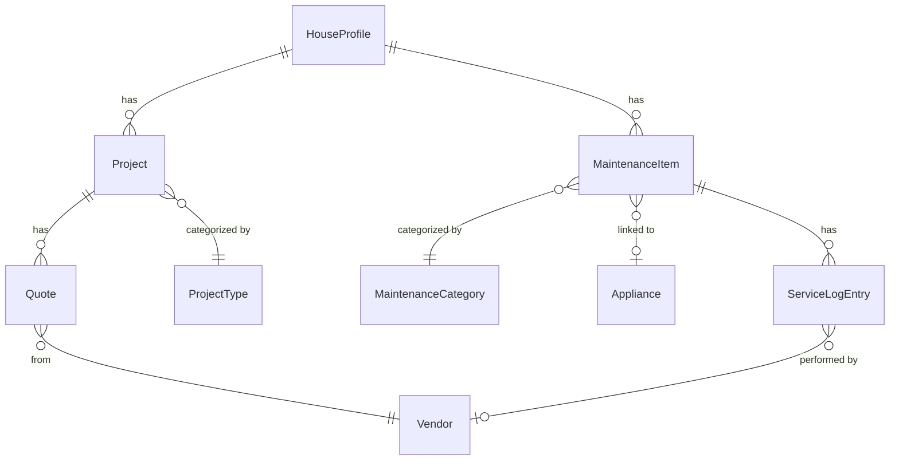

+++
title = "Data Model"
weight = 3
description = "Entities, relationships, and the design rationale behind them."
linkTitle = "Data Model"
+++

micasa stores everything in a single SQLite database. This page explains the
entities, how they connect, and why the model is shaped the way it is.

> **Reading the diagram** -- `||` means "exactly one", `o|` means "zero or one",
> `o{` means "zero or many". Read each line left to right: `Project ||--o{ Quote`
> means one project has zero or many quotes.

## House Profile

Your home's physical and financial details. One per database.

### Why this matters

- The profile is the root of the data tree -- everything else hangs off it.
- Having a single canonical record prevents duplicate-address confusion and
  gives the dashboard a fixed anchor point.

## Projects

Anything you want done to your house, from "fix the squeaky door" to
"redo the kitchen."

### Why this matters

- **Pre-seeded types** (Renovation, Repair, Landscaping, ...) keep naming
  consistent -- no "Renovation" vs "renovation" vs "Reno" drift.
- **Status lifecycle** (ideating through completed/abandoned) enables the
  settled-project toggle that hides finished work from the default view.

## Quotes

Vendor quotes linked to a project.

### Why this matters

- Every quote **requires a project**, preventing orphan records. The project
  column is a live link (`enter` jumps to it).
- **Vendor records are shared** across quotes and service log entries, so
  contact info lives in one place.

## Maintenance

Recurring upkeep tasks with an optional appliance link.

### Why this matters

- **Pre-seeded categories** (HVAC, Plumbing, Electrical, ...) keep filtering
  and sorting clean, same rationale as project types.
- The optional **appliance link** enables bidirectional navigation: jump from
  a task to its appliance, or drill from an appliance into all its tasks.
- The **service log** is a drill column -- press `enter` to open the full
  history for a given task.

## Service Log

Time-ordered records of when a maintenance task was performed, by whom, and
at what cost.

### Why this matters

- Entries **live inside a maintenance item** (accessed via drill), so they
  always have context -- no floating service records.
- The optional vendor link distinguishes DIY from hired work and carries
  contact info automatically.

## Appliances

Physical equipment in your home.

### Why this matters

- Appliances are referenced *by* maintenance items, not the other way around.
  The `Maint` drill column provides the reverse view: from any appliance,
  see everything you're doing to keep it running.

## Vendors

People and companies you hire. Shared across quotes and service log entries.

### Why this matters

- Because vendors are shared, updating a phone number **once** updates it
  everywhere.
- Vendors are created implicitly through forms -- type a name and micasa
  finds or creates the record.
