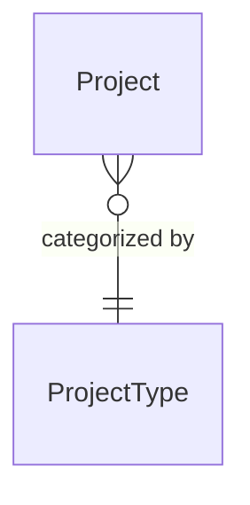
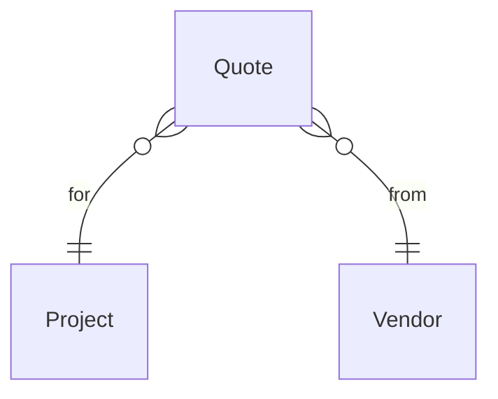
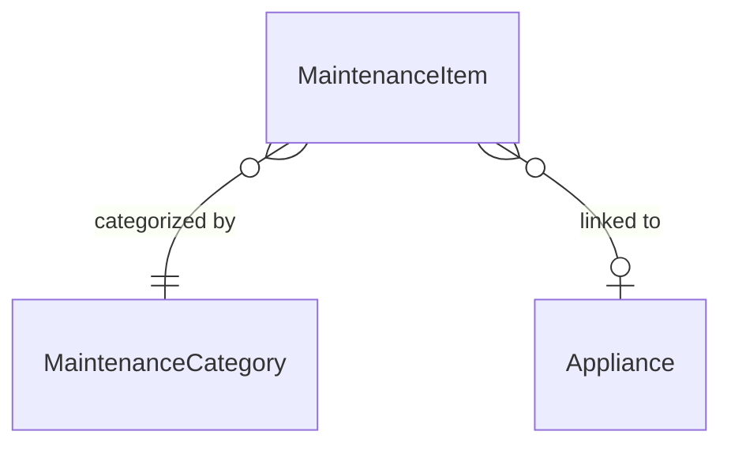
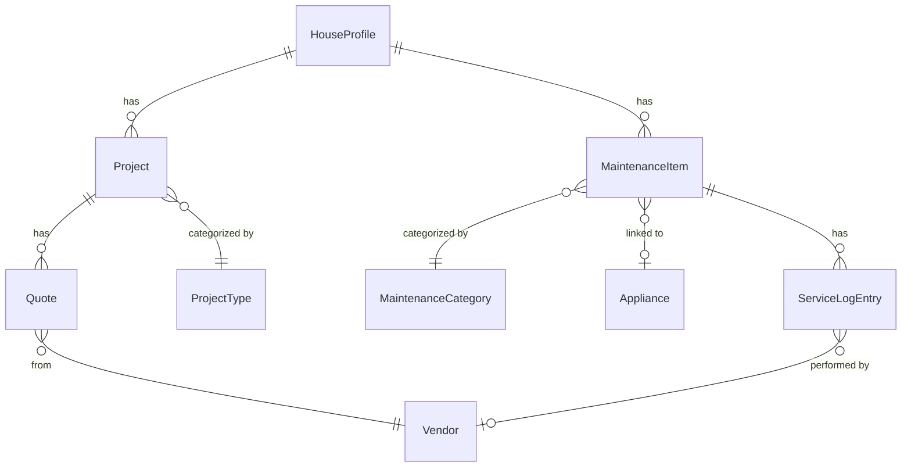

+++
title = "Concepts"
weight = 3
description = "How micasa organizes your home data."
linkTitle = "Concepts"
+++

micasa organizes home data into a few interconnected entities.

## House Profile

Your home's physical details: address, year built, square footage, bedrooms,
bathrooms, structural info (foundation, wiring, roof), utilities (heating,
cooling, water, sewer), and financial info (insurance, property tax, HOA).
There's exactly one house profile per database.

## Projects

Anything you want to do to your house, from "fix the squeaky door" to "redo
the kitchen." Each project has:

- `Type` (e.g., Renovation, Repair, Landscaping) -- these are pre-seeded
  categories
- `Status` tracking a lifecycle: ideating, planned, quoted, underway,
  delayed, completed, abandoned
- `Budget` and `Actual` cost for tracking spending
- `Start` and `End` dates

## Quotes

Vendor quotes linked to a project. Each quote has:

- `Vendor` info (name, contact, email, phone, website) -- vendors are
  shared across quotes and service log entries
- Cost breakdown: `Total`, `Labor`, `Mat`, `Other`
- `Recv` date

Quotes link to projects via a foreign key. On the Quotes tab, the `Project`
column is a navigable link -- press `enter` to jump to the linked project.

## Maintenance

Recurring upkeep tasks. Each maintenance item has:

- `Category` (e.g., HVAC, Plumbing, Electrical) -- pre-seeded
- `Appliance` link (optional) -- ties the task to a specific appliance
- Schedule: `Last` serviced date + `Every` (interval in months)
- `Next` due date: auto-computed from `Last` + `Every`
- `Log`: a time-ordered history of when the task was actually
  performed, by whom, and at what cost

The `Log` column on the Maintenance tab is a drilldown -- press `enter` to
open the service log for that item.

## Service Log

Each entry in a maintenance item's service log records:

- `Date` serviced
- `Performed By`: yourself ("Self") or a vendor
- `Cost`
- `Notes`

Service log entries are accessed by drilling into a maintenance item, not as a
standalone tab.

## Appliances

Physical equipment in your home. Each appliance tracks:

- Identity: `Name`, `Brand`, `Model`, `Serial`, `Location`
- `Purchased` date and `Warranty` expiry
- `Cost`
- Linked maintenance: the `Maint` column shows how many maintenance
  items reference this appliance. Press `enter` to drill into them.

## Vendors

Vendors are shared entities created through the Quotes and Service Log forms.
When you add a quote or service log entry, you type a vendor name; micasa
finds or creates the vendor record. Vendors have name, contact name, email,
phone, website, and notes.

## Relationships

- A **project** has many **quotes**
- A **maintenance item** optionally links to one **appliance**
- A **maintenance item** has many **service log entries**
- **Quotes** and **service log entries** reference **vendors**
- Navigable foreign keys are shown in table headers with relation indicators
  (e.g., `m:1`)

## Soft delete

All entities support soft deletion. Deleting an item hides it from the default
view but doesn't destroy data. Press `x` in Edit mode to toggle showing
deleted items, and `d` on a deleted item to restore it.
